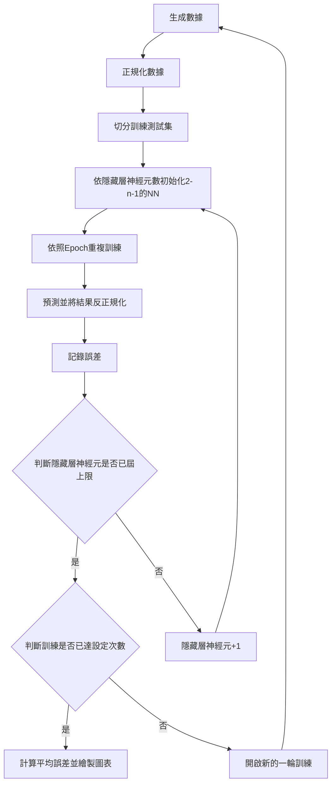
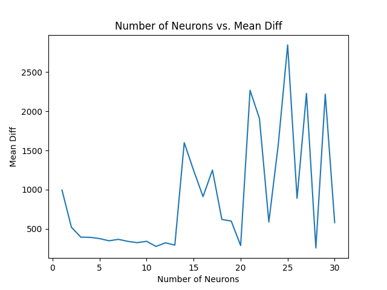
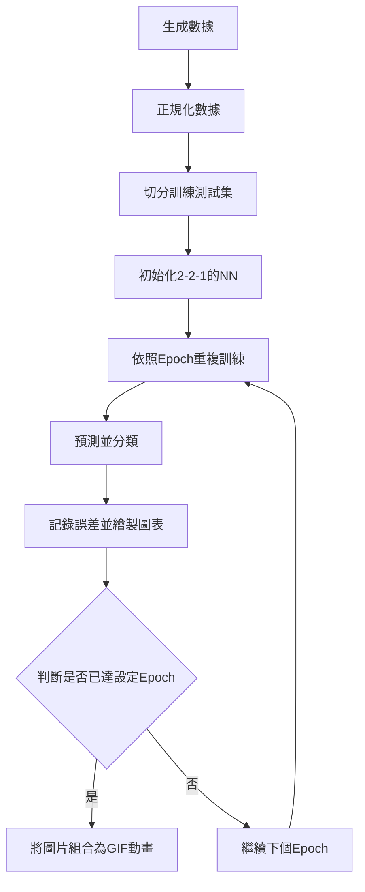
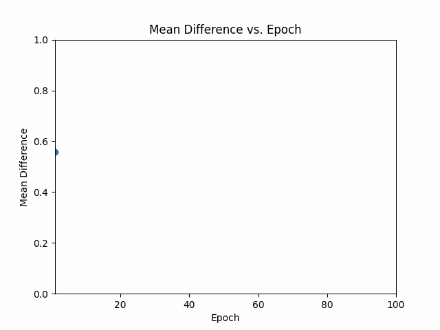

# 手刻淺層類神經
*交通與工商數據分析實驗室-第二次程式訓練作業*
 
 
 

# 題目
**訓練目標-了解類神經的運作方式、基於倒傳遞的參數調整概念，以及解讀類神經參數的意義**

## 第一階段-撰寫一個2-n-1的淺層類神經網路
1. 隱藏層的神經元使用Tangent Sigmoid作為激活函數
1. 輸出層為線性函數
1. 類神經網路的輸入為兩個四位數的數值，輸出則為這兩個數的總和
1. 調整你的隱藏層神經元數量，並畫出一張神經元數量對30次訓練結果之誤差平均的圖。
> PS1: 撰寫類神經前請先產生你的資料集，建議要有10000筆以上，接著把這個資料集切開成訓練與測試資料集。 
> PS2: 不管是輸入還是輸出都要正規化到0-1之間，而產出結果時，需要把輸出反正規化到原本的空間中。
 

## 第二階段-承作業階段一，資料集改成XOR的資料集，且類神經大小定義為2-2-1
1. 完成這個資料集的分類動作。在這個資料集中，你會產生10000筆虛擬資料
1. x的範圍可以落在[-0.5, 0.2]或[0.8, 1.5]兩個區塊中
1. y的範圍可以落在[-0.5, 0.2]或[0.8, 1.5]兩個區塊中
1. 若x與y資料落在[-0.5, 0.2]中，代表其會被轉為0，反之若落在[0.8, 1.5]中，代表其會被轉為1
1. 每個虛擬資料最後屬於哪個類別則由XOR邏輯決定。
> PS1: 類神經的輸入是x與y的數值，輸出則是一個數值，若此數值小於等於0.5，則被分到第1類，反之若大於0.5，則被分到第2類。 這個類神經的輸入與輸出都要先完成正規化後才能開始類神經的訓練 
> PS2: 請把每次訓練的參數結果視覺化呈現出來(能做成動態更佳，如下面的影片所示)，並嘗試解讀這樣的視覺化結果  

<video src="https://github.com/jihshiann/NeuralNetwork/blob/main/%E5%8B%95%E6%85%8B%E8%A6%96%E8%A6%BA%E7%AF%84%E4%BE%8B.mp4" width="640" height="360" controls></video>
 
 
 

# 結果
## 第一階段
1. 參數:  
> 隱藏層神經元個數 = 1~30、學習率 = 0.1%  
> Epoch = 100、訓練次數 = 30  
> 生成數據量 = 30000、訓練集/測試集比例 = 70%/30%  
> 輸入 = 兩四位數字、輸出 = 輸入相加  
> 正規化 => (輸入-最小值)/(最大值-最小值)  
> Activation Function => f(x) = (exp(x) - exp(-x)) / (exp(x) + exp(-x)) 

2. 執行流程

3. 訓練結果  

 

## 第二階段
1. 參數:  
> 隱藏層神經元個數 = n、學習率 = 0.1%  
> Epoch = 100、訓練次數 = 1  
> 生成數據量 = 10000、訓練集/測試集比例 = 70%/30%  
> 輸入 = 兩介於[-0.5. 0.2] 或 [0.8, 1.5數字]、輸出 = 1或0  
> 正規化 => (輸入-最小值)/(最大值-最小值)  
> Activation Function => f(x) = (exp(x) - exp(-x)) / (exp(x) + exp(-x)) 
> 分類: Y = 0; if Y <= 0.5| Y=1; else
 

3. 執行流程

3. 訓練結果  

